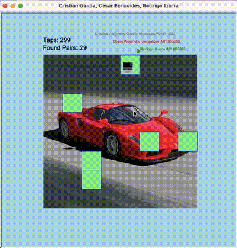

# Actividad 4. Memorama Evidencia de competencias
### Integrantes 
- **Alejandro García** - A01641920
- **César Benavides**  - A01285056
- **Rodrigo Ibarra**   - A01625569
---
## Funciones Añadidas o Modificadas
### 1. info_alumnos(): 
Función que despliega la información de los alumnos

*Realizado por Alejandro García*
``` python
# Función que pone la información de los integrantes
def info_alumnos():
    info.up()
    info.goto(-65,250)
    info.color('gray')
    info.write('Cristian Alejandro García Mendoza A01641920', align='left', font=('Arial', 10, 'normal'))
    info.goto(-19,230)
    info.color('red')
    info.write('César Alejandro Benavides Martínez A01285056', align='left', font=('Arial', 10, 'normal'))
    info.goto(53,210)
    info.color('green')
    info.write('Rodrigo Ibarra A01625569', align='left', font=('Arial', 10, 'normal'))

 ``` 
## 2. Contar y desplegar número de taps: 
Cuenta la cantidad de taps y los despliega

*Realizado por Rodrigo Ibarra*
``` python
# Función para manejar el tap/click del usuario
def tap(x, y):
    """Update mark and hidden tiles based on tap."""
    global tap_count, pairs_found  # Acceder a las variables globales
    tap_count += 1  # Incrementar el contador de taps

    if x >=-200 and x<=200 and y>=-200 and y<200:
        # Posición de la última carta seleccionada
        spot = index(x + 5, y + 30)
    print(x)
    # Posición de la carta anterior o si no había carta anterior tendrá un None
    mark = state['mark']
    
    # Checa si no hay carta previa, se dio click en la misma carta, no son par
    if mark is None or mark == spot or tiles[mark] != tiles[spot]:
        state['mark'] = spot
    else:
        # Si fue par, destapar las 2 cartas
        hide[spot] = False
        hide[mark] = False
        # Ya no existe carta destapada
        state['mark'] = None
        pairs_found += 1  # Incrementar contador de parejas encontradas

    
    # Verificar si todos los cuadros están destapados
    if all(not h for h in hide):
        messagebox.showinfo("¡Felicidades!", f"¡Ganaste un auto!!\nTaps: {tap_count}")

    # Mostrar el número de taps y parejas encontradas en la ventana
    goto(-200, 210)
    color('black')
    write(f"Found Pairs: {pairs_found}", font=('Arial', 16, 'normal'))
    goto(-200, 230)
    write(f"Taps: {tap_count}", font=('Arial', 16, 'normal'))
 ``` 

### 3. Lista de emojis y cambio del nombre en ventana: 
Uso de emojis y título con los nombres de los integrantes

*Realizado por César Benavides*
``` python
# Lista de emojis de temática "Tecnología"
emojis = ['👨‍💻', '📱', '💻', '🖥️', '📀', '🎧', '📷', '📡',
          '🛰️', '🚀', '👩‍🚀', '👾', '🕹️', '🎮', '🔌', '🧲',
          '⚡', '🤖', '💡', '📟', '🖨️', '🖲️', '📠', '☎️',
          '📞', '🌐', '📶‍', '🔬', '🧑‍🦼', '👽', '🦾', '🤖',]

# Agrega el título a la ventana del juego
title("Cristian García, César Benavides, Rodrigo Ibarra")
 ``` 

---
## Funcionamiento
