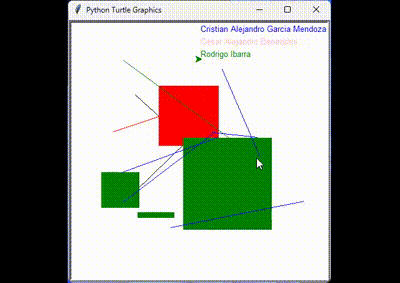

# TC1001S.101Paint
## Paint Code
### Integrantes 
- **Alejandro Garcia** - A01641920
- **Cesar Benavides**  - A01285056
- **Rodrigo Ibarra**   - A01625569
---
## Funciones Añadidas o Modificadas
### 1. Circle2: 
Realiza un circulo dentro del canvas, desde el primer click hasta el segundo, estableciendo el radio

*Realizado por Alejandro Garcia*

```python

def circle2(start, end):
    up()
    goto(start.x, start.y)
    down()
    radius = (end.x - start.x) / 2  # Calcular el radio
    circle(radius)
 ``` 

### 2. Rectangle: 
Realiza un rectangulo, definiendo uno de los vertices con el primer click y el vertice contrario

*Realizado por Cesar Benavides*
```python
# Función para dibujar un rectángulo desde el punto de inicio hasta el punto final
def rectangle(start, end):
    """Draw rectangle from start to end."""
    up()
    goto(start.x, start.y)
    down()
    begin_fill()

    for _ in range(2):  # Repetir dos veces para completar el rectángulo
        forward(end.x - start.x)
        left(90)
        forward(end.y - start.y)
        left(90)

    end_fill()
```

### 3. Triangle: 
Realiza un triangulo desde un punto de inicio hasta un punto final

*Realizado por Cesar Benavides*

```python
# Función para dibujar un triángulo desde el punto de inicio hasta el punto final
def triangle(start, end):
    """Draw triangle from start to end."""
    up()
    goto(start.x, start.y)
    down()
    begin_fill()

    for _ in range(3):  # Repetir tres veces para completar el triángulo
        forward(end.x - start.x)
        left(120)

    end_fill()
```

---
## Funcionamiento

