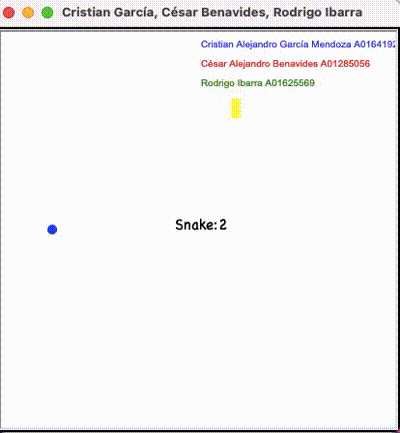

# Actividad 3. Modificación del juego Snake.
### Integrantes 
- **Alejandro Garcia** - A01641920
- **Cesar Benavides**  - A01285056
- **Rodrigo Ibarra**   - A01625569
---
## Funciones Añadidas o Modificadas
### 1. move_food(): 
Función que mueve la comida y evalua que su posición sea correcta

*Realizado por Alejandro García*
``` python
#Función que mueve la comida y evalua que su posición sea correcta
def move_food():
    global cont
    cont = 0
    """Move food to a valid random position."""
    for i in range(cont+1): # Genera posiciones random para la comida
        food.x = randrange(-18, 18) * 10
        food.y = randrange(-19, 19) * 10
        # Cambia el índice del color de la serpiente si come
        global color_index
        color_index = randrange(0, 8)
        if food not in snake:
            break
 ``` 
### 2. info_alumnos(): 
Función que pone la información de los integrantes

*Realizado por Alejandro García*
``` python
# Función que pone la información de los integrantes
def info_alumnos():
    info.up()
    info.goto(0,190)
    info.color('blue')
    info.write('Cristian Alejandro García Mendoza A01641920', align='left', font=('Arial', 10, 'normal'))
    info.goto(0,170)
    info.color('red')
    info.write('César Alejandro Benavides A01285056', align='left', font=('Arial', 10, 'normal'))
    info.goto(0,150)
    info.color('green')
    info.write('Rodrigo Ibarra A01625569', align='left', font=('Arial', 10, 'normal'))
    info.hideturtle()
```

### 3. Colores del Snake y Comida: 
Variables para cambiar el color del snake y de la comida

*Realizado por Rodrigo Ibarra*
``` python
colors = ['blue', 'yellow', 'purple', 'orange', 'pink', 'black', 'brown', 'cyan']
color_index = 0
color_index = randrange(0, 8) #Randomizar el color
# Se dibuja el snake
for body in snake:
    square(body.x, body.y, 9, colors[color_index])

# Se dibuja la comida
dot(10, colors[color_index-1])
```

### 4. Dot en lugar de square:
Uso de círculo en lugar de cuadrado en la comida

*Realizado por César Benavides*
``` python
center_x = food.x + 4.5  # Suma 4.5 para obtener el centro en el eje x
center_y = food.y + 4.5  # Suma 4.5 para obtener el centro en el eje y
goto(center_x, center_y)
dot(10, colors[color_index-1])
```

### 5. Cambio del nombre de la ventana:
Cambio del nombre de la ventana del juego

*Realizado por César Benavides*
``` python
title("Cristian García, César Benavides, Rodrigo Ibarra")
```
---
## Funcionamiento
